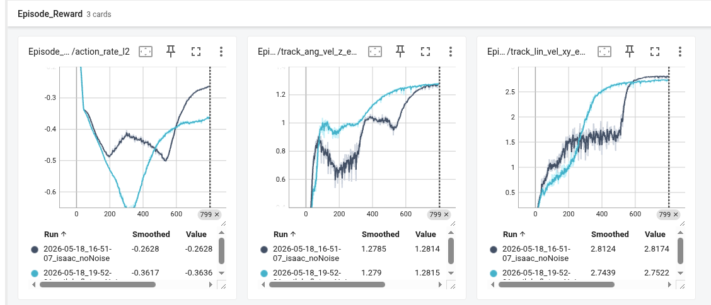

# migrate "go2w loco" task of robot lab from IsaacLab to mjlab

## common commands

train Mjlab-RpyBhTrack-Flat-Unitree-B2 --env.scene.num-envs 4096   --agent.max-iterations 800
play Mjlab-RpyBhTrack-Flat-Unitree-B2  --checkpoint_file  logs/rsl_rl/unitree_b2_rpy_bh_track/2026-05-24_20-16-54/model_799.pt

## install mjlab v1.3.0

报错：   driver_ver = wp.context.runtime.driver_version
AttributeError: module 'warp' has no attribute 'context'. Did you mean: 'constant'?

mujoco-warp                  3.8.0            pypi_0           pypi
warp-lang                    1.12.1           pypi_0           pypi

## project structure

在这个project中有两个task，anymal_c_velocity和go2w_loco,其中的anymal_c_velocity来自mjlab的example，用来说明如何组织目录结构，见Create_Task.md

**主要关注的文件**：  
asset_zoo/robot/unitree_go2w/

task/go2w/env_cfg.py
task/go2w/velocity_env_cfg.py  
task/go2w/mdp/

**可能遇到的问题**：  
将robot_lab从isaaclab迁移到mjlab，类似isaaclab的external project，这里也在mjlab外部新建一个project folder。  
如果pip install -e . 之后修改了包的结构：

```toml
# pyproject.toml:

[project.entry-points."mjlab.tasks"]
robot_lab = "robot_lab.tasks"
```

即使uninstall之后再pip install -e .，可能使得.pth文件，.dist-info目录的内容有错误（没有被更新），解决办法是删除robo_lab或者anymal_c_velocity相关package的pth文件，.dist-info目录，重新pip install -e .

## src/robot_lab/assets_zoo/robots

1. unitree_go2w 从robot_lab中的go2w的urdf模型转换得到
2. unitree_go2w_official 来自unitree_mujoco repo, 宇树在go2基础上修改的  

## contact sonsor

ContactSensor的配置略有不同：mjlab在配置ContactSensorCfg的时候，就指定了contact sensor的关注对象。

```python
# isaaclab

contact_forces = ContactSensorCfg(prim_path="{ENV_REGEX_NS}/Robot/.*", history_length=3, track_air_time=True)
```

```python
# mjlab

feet_ground_cfg = ContactSensorCfg(
name="feet_ground_contact",
primary=ContactMatch(mode="geom", pattern=geom_names, entity="robot"),
secondary=ContactMatch(mode="body", pattern="terrain"),
fields=("found", "force"),
reduce="netforce",
num_slots=1, 
track_air_time=True,
history_length=4,
)

nonfeet_ground_cfg = ContactSensorCfg(
name="nonfeet_ground_contact",
primary=ContactMatch(mode="geom", pattern=r".*_collision\d*$", entity="robot", exclude=tuple(geom_names)),
secondary=ContactMatch(mode="body", pattern="terrain"),
fields=("found", "force"),
reduce="none",
num_slots=1,
history_length=4,
)
```

history_length should be the same as decimation

## NaN value in Obs

在obs中发现nan值，训练被停止  
发生在rsl-rl：

```python
check_nan(obs, rewards, dones)
```

mjlab repo中有提到这个问题

## EAP过小

训练过程中警告EPA过小，原因在于训练之初会发生较多的碰撞，这是mujoco warp中关于碰撞检测的一个配置项。
Change MJ_MAX_EPAHORIZON to 50 from 24 可以消除警告，增大这个值会明显增大显存的占用。

note：改变前后对训练影响非常小

## 实验对比

去掉其他reward term，只保留了base的线速度和角的的速度的跟踪和action_rate这三项（计算公式参robot_lab）  
去掉了所有域随机化和actior obs中的Noise
terrain 设置为flat

在尝试的所有实验中，在上述配置下对比，此项目的训练曲线和原robot_lab的训练曲线最接近，但是仍然存在差异

